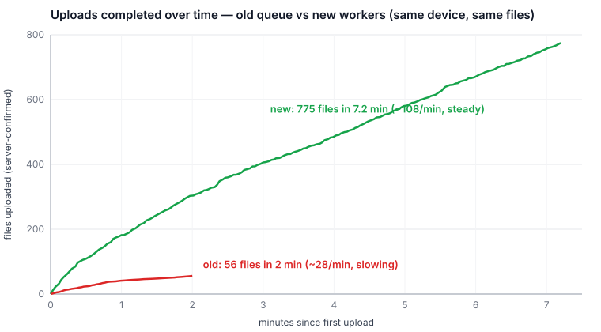
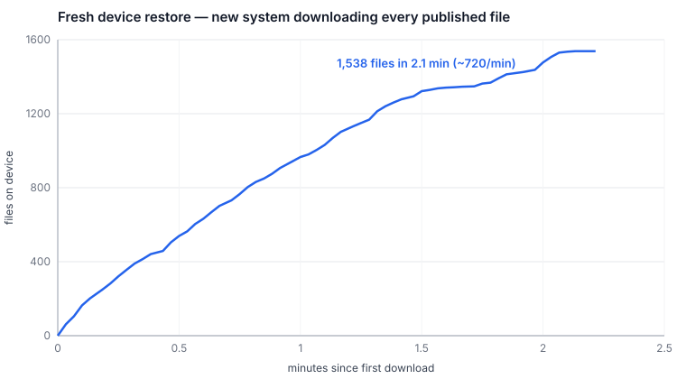
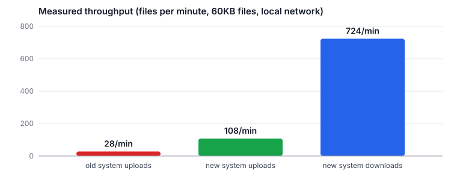

# Audio sync rewrite: what changed, and the benchmark numbers

**TLDR:** We replaced the attachment queue that synced audio files between devices
and the server. On the same phone, uploading the same files to the same server,
the old system managed ~28 uploads/minute and got slower the longer it ran; the
new system holds a steady ~108/minute and downloads at ~720/minute. The upgrade
path works: a device with thousands of un-uploaded recordings keeps every file
and starts draining the backlog within seconds of the new version launching.

## The problem

We have users in the field with **tens of thousands of recordings** on their
devices. Their quests published fine — the database records made it to the
server — but the audio files themselves never finished uploading. The files
are (hopefully) still sitting on their phones. The old sync system was
struggling so badly at that scale that the app became sluggish and uploads
crawled, which is what prompted the rewrite.

## How the old system worked, and what was wrong with it

Both systems have to answer the same question: **"which audio files still need
to be uploaded or downloaded?"**

The old system answered it by keeping a notebook. The `attachments` table was
a notebook with one entry per file: "this file exists, it's uploaded" or "this
file needs downloading." A notebook is only useful if it's accurate, so every
time anything changed, the system had to check the whole notebook against
reality:

- It pulled the full list of every audio file the app knows about (a big join
  query — 20,000 rows even if one recording changed), to check whether any
  file was missing from the notebook.
- It read the entire notebook (`SELECT * FROM attachments`), to check each
  file on the list against its notebook entry, one by one.
- It stat'd every file on disk (`fileExists()` × 20,000), to check that no
  notebook entry was lying about a file that had been deleted.
- And every correction it made to the notebook was itself a change, which woke
  up the parts of the system watching the notebook, which read it again.

All that work, on every change, just to keep the notebook trustworthy — and it
scaled with the *total* number of files, not the number that actually needed
syncing.

## What we changed

The new system threw the notebook away, because both facts it recorded already
exist somewhere authoritative:

- **"Does this need uploading?"** is already answered by the record itself: an
  `asset_content_link` row with audio but no `audio_uploaded_at` stamp is an
  un-uploaded file. (The stamp is set by the server when the file arrives —
  clients can't fake it.) The uploader asks the database "give me rows without
  a stamp" — an indexed query that returns only the pending handful.
- **"Do we have this file?"** is already answered by the disk. The app lists
  the audio folder once at startup into an in-memory index, and everything
  that saves a file adds one name to it. Checking a file is a memory lookup.

No copy of the facts, nothing to keep honest, no bookkeeping writes that wake
everything up again.

## What we needed to verify

1. **Baseline:** how bad is the old system, measured, with 10,000 pending files?
2. **The upgrade:** when a stranded device updates to the new version, do all
   the files survive, enter the new upload flow, and drain — with sane
   progress UI?
3. **The new system end to end:** uploads, fresh-device downloads, offline
   behavior, and recovery.

## How we tested

Nobody wants to record 10,000 files, so we seeded the state directly:

- A script inserted 10,000 published records into the local server database,
  each naming an audio file that storage doesn't have — exactly the stranded
  state.
- A second script planted 10,000 matching 60KB WAV files on the phone over USB.
- Because the rewrite is JavaScript-only, one installed dev build runs either
  version: switching git branches and reloading **is** the upgrade, with the
  database and files persisting in place — same as a real user updating.
- A benchmark script measured from the outside, identically for both systems:
  server-confirmed upload counts from the database, file counts from the
  device, stage timings from the app logs. A throttling proxy sat between the
  phone and the server so we could degrade or sever the connection without
  touching the phone's wifi.

## Results

### Uploads: same phone, same files, same server

The old system's curve is the story: **~41 uploads in its first minute, ~15 in
its second** — the per-file cost grew from ~2s to ~5s as its own bookkeeping
churned. The new system ran flat at ~108/minute for the whole observed run.

The lead-up matters too: after login, the old system spent **~90 seconds** on
its full reconcile before the first byte moved. The new system's first upload
confirmed **~5 seconds** after its workers started.

### Downloads: restoring a fresh device

After wiping the device and logging back in, the new system pulled every
published file back down at **~720 files/minute** — 1,538 files in just over
two minutes, then stopped cleanly at exactly the right count. (The old
system's download path wasn't benchmarked.)

### Throughput summary

| | Old system | New system |
|---|---|---|
| Time from sync start to first upload | ~90 s | ~5 s |
| Upload throughput | ~28/min, degrading | ~108/min, steady |
| Download throughput (fresh device) | not measured | ~720/min |
| Projected 10,000 uploads | 6+ hours, worsening as it goes | ~1.5 hours |
| Projected 10,000 downloads | — | ~14 minutes |

### The upgrade itself

Switching a device holding 10,001 files and ~9,300 pending uploads to the new
version: the schema migration completed in seconds, the file index reported
all files intact, and the uploader's first pass picked up the entire backlog
(`Uploading 9338 of 9338 pending file(s)`). No files lost, no re-uploads of
already-confirmed files, progress bars live in the drawer.

### Caveats

- Absolute rates are flattering to both systems: 60KB files over a local
  network. Real devices on rural connections will be slower everywhere — but
  both systems were measured under identical conditions, and the old system's
  degradation curve comes from its own bookkeeping, not the network.
- The old-system run was observed for ~5 minutes and the new-system upload run
  for ~8 (long enough to establish rate and trend; nobody watched a 6-hour
  crawl to the end). The download test covered the 1,546 files that had been
  uploaded by then.

## The one-liner to pass along

The old system kept its own records of which files needed syncing and burned
enormous effort keeping those records honest; the new system asks the data
itself — no stamp means upload it, not on disk means download it — so there's
nothing to keep honest.
