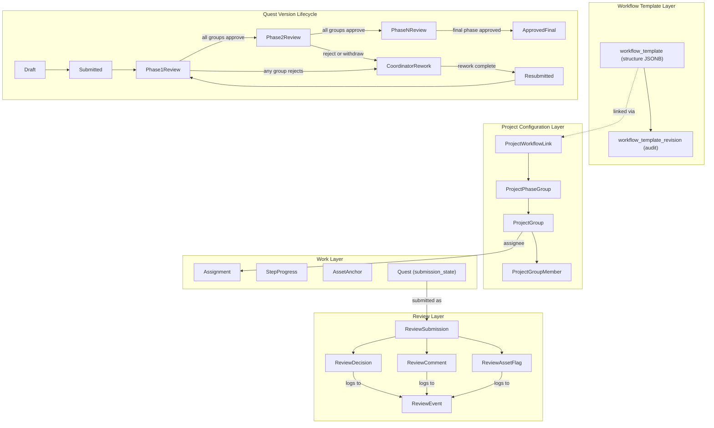

# Review Workflow RFC

**Status:** Draft | **Date:** 2026-05-22 | **Authors:** Frontier R&D
**Stakeholders:** ETEN Innovation Lab, Word Collective, Spoken

---

## 1. Context & Problem

LangQuest currently has no formal review process. Translators record, community members vote (net upvotes = approved), and that's it. No staged validation, no reviewer roles, no audit trail.

ETEN needs a multi-stage, church-governed review process (Team → Community → Church → Blessing Board). But their process is just one instance — other partners will define their own. **This RFC designs a generic review workflow system** that satisfies ETEN while remaining configurable for others.

**Relevant existing code:** `utils/progressUtils.ts` (vote-based approval), `profile_project_link.membership` (owner|member only), `hooks/useFiaPericopes.ts` (multi-version quests), `hooks/useNotifications.ts` (in-app notifications for invites/requests only).

---

## 2. Goals & Non-Goals

**Goals:** 
- Generic multi-stage review workflow  
- Configurable groups, phases, signoff rules  
- Reusable workflow templates  
- Quest-level gating with per-asset rework flags  
- Full audit trail  
- Generic step/progress tracking  
- Contributions anchored to methodology steps  
- Assignments  
- Coordinator-mediated rework delegation

**Out of scope:** QR/WhatsApp onboarding  
- AI features  
- Publication pipeline (Versify/Transcribe/Ethne)  
- Remix UI redesign  
- Push/email/WhatsApp notifications  
- PowerSync bucket rule definitions

---

## 3. Conceptual Model



**Key changes to existing schema:**
- `quest` gains `submission_state` field
- `asset.content_type` gains new values for contributions
- `project_group` is new and orthogonal to `profile_project_link`
- `review_event` is append-only, server-only (not synced to devices)
- `workflow_template` uses same JSONB architecture as content templates

---

## 4. ETEN Requirements → Technical Mapping

| ETEN Requirement | Solution |
|---|---|
| Assign passages to translators | `assignment` table — links profile/group to quest/asset |
| Ensure Understanding stages done (FIA 1-5) | `workflow_template.structure.steps[]` + `step_progress` — boolean per user/quest/step |
| Ensure Translate stage done (FIA 6) | Same step system; recording uses existing `RecordingView` |
| Record multiple times, choose best | Existing multi-version quests + new `quest.submission_state` — only one in pipeline per pericope |
| Capture discussion/rationale/key terms/media | Extended `asset.content_type` + `asset_anchor` linking to methodology steps |
| Different review cycles (Team/Community/Church/Board) | `workflow_template` with ordered phases containing parallel group slots |
| Reviewers give feedback, translators refine | `review_comment` (threaded, targets submission or asset) + `review_asset_flag` |
| Approved → advance; rejected → return | Phase advancement rules; rejection routes to coordinator via `assignment` |
| Reviewer can withdraw approval | `review_decision` supports withdraw; cascades invalidate all downstream decisions |
| Audit trail | Append-only `review_event` log — website-only timeline view |
| Progress visibility | Website dashboard aggregating submissions + decisions + step_progress |
| Easier onboarding | Group membership + assignments make work visible; notifications surface tasks |

---

## 5. Workflow Templates

Reusable blueprints for review processes. System-provided (e.g., ETEN CBBT) or user-created. Follows the same JSONB + fork-always architecture as the content template system (see `caleb/content-templates` branch).

**Database tables:**

- **`workflow_template`** — Single table. Fields: id, name, description, slug, creator_id (null = system), `structure` (JSONB), copied_from_template_id (provenance chain), shared, active, project_count, created_at, last_updated.
- **`workflow_template_revision`** — Audit only, not synced. Fields: template ref, structure snapshot, actions (structured diff), saved_by, saved_at.

**`structure` JSONB shape:**

```typescript
type WorkflowStructure = {
  format_version: number;
  steps: WorkflowStep[];   // pre-translation preparation
  phases: WorkflowPhase[]; // ordered review stages
};

type WorkflowStep = {
  id: string;              // nanoid(10), stable, immutable
  name: string;
  order_index: number;
  description?: string;
  required: boolean;
  deleted?: boolean;       // tombstone for backward compat
};

type WorkflowPhase = {
  id: string;              // nanoid(10), stable, immutable
  name: string;
  order_index: number;
  signoff_rule: 'any_one' | 'unanimous' | 'quorum';
  quorum_threshold?: number;
  group_slots: WorkflowGroupSlot[];
  deleted?: boolean;
};

type WorkflowGroupSlot = {
  id: string;              // nanoid(10), stable, immutable
  name: string;
  description?: string;
  deleted?: boolean;
};
```

**Key decisions:**
- `project.template` (unstructured|bible|fia) stays as content-shape only. Review workflows are separate — a project links to a `workflow_template` independently via `project_workflow_link`.
- Published templates are immutable. Edits = fork-always (new row, `copied_from_template_id` tracks lineage).
- Editing is website-only, browser-side drafts in IndexedDB. No server-side draft state.
- Referencing entities (review_decision, step_progress) use `phase_id` / `step_id` strings pointing into the JSONB — not FK'd, validated at application level.
- `deleted: true` tombstones preserve referential integrity when phases/steps are removed from a template that's in use.

**RPCs:** `publish_workflow_template`, `fork_workflow_template`, `save_workflow_template_metadata` — mirrors content template system.

---

## 6. Project Workflow Link

Projects adopt a workflow template via a link table (same pattern as `project_template_link`).

- **`project_workflow_link`** — Fields: id, project_id (unique — one workflow per project), workflow_template_id, frozen, active, created_at.
- **`project_phase_group`** — Maps abstract group slots to real project groups. Fields: id, workflow_link ref, phase_id (string into JSONB), group_slot_id (string into JSONB), group ref (FK to `project_group`).

**Semantics:**
- One `project_workflow_link` per project (enforced by unique constraint on project_id).
- `frozen = true` prevents re-pointing to a new template version (e.g., mid-review safety).
- Coordinators pick a template, then map each group_slot to a real `project_group` via `project_phase_group`.
- Template changes don't propagate automatically — coordinator must explicitly adopt a new fork.
- Compatibility check before re-pointing: all `phase_id` / `step_id` values referenced by existing `review_decision` and `step_progress` rows must exist in the target template (including tombstoned entries).

---

## 7. Groups

New first-class entity separate from existing `profile_project_link` (which stays for owner/member access control).

- **`project_group`** — Fields: project ref, name, role_type (`translator`|`reviewer`|`coordinator`), description, active.
- **`project_group_member`** — Fields: group ref, profile ref, active.

Groups are the unit of both assignment (translation teams) and review (reviewer groups). A profile can belong to multiple groups. The `coordinator` role type identifies who can delegate rework and manage assignments.

---

## 8. Assignments

Single table for both initial translation work and rework delegation.

- **`assignment`** — Fields: project ref, target_type (`quest`|`asset`), target_id, assignee_type (`profile`|`group`), assignee_id, assignment_type (`translation`|`rework`), status (`pending`|`in_progress`|`completed`|`cancelled`), assigner (profile ref), notes.

**Flow:** Coordinator assigns → translator sees in-app → translator completes → (if rework) coordinator resubmits for review.

---

## 9. Step / Progress System

Generic, template-agnostic tracking of preparation step completion.

- Steps are defined in `workflow_template.structure.steps[]` — each has a stable `id`.
- **`step_progress`** — Fields: workflow_link ref, step_id (string into JSONB), profile ref, quest ref (scope), completed (boolean), completed_at.

**Progress = completed steps / total required steps.** Contribution counts per step are displayed alongside but do NOT affect the percentage. Translators self-attest completion; coordinators can mark on behalf of translators.

---

## 10. Contributions & Anchoring

Contributions (discussion, key terms, rationale, drawings) reuse the existing `asset` infrastructure.

**Extended `asset.content_type` values:** `discussion` | `rationale` | `key_term` | `media` (in addition to existing `source`|`translation`|`transcription`).

- **`asset_anchor`** — Links contribution asset to methodology content. Fields: asset ref, step ref, element_id (nullable — substep identifier), anchor_type (`step`|`sub_element`|`text_range`|`audio_range`), anchor_data (JSON).

Contributions are inherently cross-version because they anchor to template steps, not specific quest versions. Remix can pull contributions the same way it pulls recordings.

**Open questions:** Contribution scope (pericope vs team vs project) and anchor granularity (step-only vs freeform). See section 19.

---

## 11. Quest Versions, "Best", and Remix

Multiple quest versions per pericope already exist as separate `quest` rows.

**New field:** `quest.submission_state` — enum: `draft`|`submitted`|`in_review`|`rework`|`withdrawn`|`approved_final`. Default `draft`. Only one quest per pericope per project can be in a non-draft/non-withdrawn state at a time (partial unique constraint).

**Lifecycle:** draft → submitted → in_review → (rejected → rework → resubmitted → in_review) or (all phases approve → approved_final). Can withdraw at any point before approved_final.

**Remix:** Creates a new `quest` row via `parent_id` links. Enters review identically to any other version. See `claude_artifact_quest_remix_example.jsx` for UX reference.

---

## 12. Submission & Review Flow

Core of the system. A submitted quest version moves through the project's configured phases.

**New entities:**

- **`review_submission`** — One per quest-version review pass. Fields: quest ref, workflow_link ref, current_phase_id (string into JSONB), status (`pending`|`in_review`|`rework`|`completed`|`withdrawn`), submitted_by, submitted_at. Reused across rework cycles (audit log captures history).
- **`review_decision`** — One group's verdict at one phase. Fields: submission ref, phase_id (string into JSONB), group_slot_id (string into JSONB), group ref, decision (`approved`|`rejected`|`withdrawn`), decided_by, reason, decided_at, active flag.
- **`review_comment`** — Threaded discussion. Fields: submission ref, author, target_type (`submission`|`asset`|`comment`), target_id, body, audio ref, created_at.
- **`review_asset_flag`** — Per-asset rework marker. Fields: submission ref, asset ref, flagged_by, reason, status (`open`|`resolved`), resolved_by, resolved_at.

**Phase advancement:**
1. Submission enters phase → all mapped groups receive it
2. Each group evaluates per its signoff rule (`any_one` / `unanimous` / `quorum`)
3. All groups approve → advance to next phase. Any group rejects → rework state.
4. Final phase approved → `approved_final`

**Withdraw cascade:** Withdrawing at phase N invalidates all decisions at phases > N and returns submission to phase N. By design — a late concern from an early reviewer invalidates downstream approvals.

**Key constraint:** Quest cannot advance while any `review_asset_flag` has status `open`.

---

## 13. Rework Routing

Rejection always routes to the coordinator, who delegates.

1. Rejection/withdrawal occurs → submission status becomes `rework`
2. Coordinator is notified
3. Coordinator reviews comments and asset flags
4. Coordinator creates rework `assignment` targeting quest/assets, assigned to translator
5. Translator reworks and marks assignment completed
6. Coordinator resubmits → re-enters at **phase 1** by default

Phase-1 restart ensures all reviewers re-validate after changes. Resume-at-rejected-phase is an open question for future configuration.

---

## 14. Audit Log

- **`review_event`** — Append-only, never updated/deleted. Fields: event_type, actor (profile), target_type, target_id, payload (JSON), project ref, created_at.

**Event types:** `submitted`, `approved`, `rejected`, `withdrawn`, `cascade_invalidated`, `comment_added`, `comment_edited`, `asset_flagged`, `asset_unflagged`, `rework_assigned`, `rework_completed`, `phase_advanced`, `workflow_completed`, `submission_withdrawn`

Server-only (not synced via PowerSync). Website queries Postgres directly for timeline rendering.

---

## 15. Notifications

Extends existing `notification` table with new `target_table_name` values: `review_submission`, `review_decision`, `assignment`.

**Recipients:**
- Quest submitted → first-phase review groups
- Phase advanced → next-phase review groups
- Rejected → coordinator group
- Rework assigned → assigned translator/group
- Rework completed → assigning coordinator
- Approved final → submitter, coordinator, subscribers
- Withdrawal → coordinator, affected downstream reviewers

In-app only for now. Appears in existing `NotificationsView`. Push/email/WhatsApp deferred.

---

## 16. App vs Website Split

| Surface | App | Website |
|---|:---:|:---:|
| View assignments / submission state / comments | Both | Both |
| Record translations / mark steps complete | App | - |
| Create contributions | App | - |
| Submit for review / cast decisions / flag assets | App | - |
| Mark rework completed | App | - |
| Create/edit workflow templates | - | Website |
| Instantiate workflow / manage phases | - | Website |
| Manage groups / group membership | - | Website |
| Create assignments / delegate rework | - | Website |
| Full audit trail timeline | - | Website |
| Cross-project oversight / analytics | - | Website |

---

## 17. Sync (PowerSync)

**Synced to devices:** `workflow_template` (active templates only), `project_workflow_link`, `project_phase_group`, `project_group`, `project_group_member`, `assignment`, `step_progress`, `asset_anchor`, `review_submission`, `review_decision`, `review_comment`, `review_asset_flag`

**NOT synced (server-only):** `review_event` (large, website-only), `workflow_template_revision` (audit)

**Write patterns:** Translators write step_progress + assets + assignment status. Reviewers write decisions + comments + flags. Coordinators write configuration from website.

**Conflict avoidance:** Review state machine transitions (`review_submission.status`, `current_phase`) are server-side only — clients don't directly update these. Decisions/comments are append-only.

---

## 18. Migration & Rollout

1. **Additive only.** Existing tables unchanged except `quest` gains `submission_state` (default `draft`) and `asset.content_type` gains new enum values. Backward-compatible.
2. **Opt-in.** Projects without a `project_workflow` keep using vote-based approval unchanged.
3. **System CBBT template** ships with 4-5 review phases + 6 FIA preparation steps.
4. **No auto-adoption.** Existing FIA projects don't get a workflow unless coordinator explicitly opts in.
5. **Website config first** → app review surfaces second.

---

## 19. Open Design Questions

- **Contribution scope** — Pericope-shared (simplest for cross-version), team-scoped (privacy), or project-wide (broadest)?
- **Anchor granularity** — Step-level + optional element_id for MVP? Or freeform text/audio ranges? Recommend deferring freeform.
- **Resubmit: restart vs resume** — Restart at phase 1 is safest default. Could be per-phase config later.
- **Quorum threshold format** — Absolute count, percentage, or fraction? Recommend fraction with auto-adjusting denominator.
- **`submission_state` vs `active`/`visible`/`quest_closure`** — Orthogonal fields, but `quest_closure.approved_translations` needs a workflow-aware equivalent for workflow-enabled projects.
- **Coordinator-as-proxy** — Should `review_comment` support `on_behalf_of`? Or just attribute to coordinator with notes? May follow from WhatsApp/QR work.
- **Workflow template compatibility with content templates** — Should a workflow template declare which content templates it's designed for (metadata field), enabling smart defaults when linking?

---

## 20. Deferred

- **QR/WhatsApp onboarding** — Separate from review architecture
- **AI features** — Workflow is AI-agnostic; AI content enters the same pipeline
- **Publication (Versify/Transcribe/Ethne)** — Downstream of `approved_final`; starts from existing `export_quest_artifact`
- **Remix UI redesign** — Remix produces quest versions that enter review normally
- **Proxy reviewer detailed UX** — Noted in open questions; full design deferred
