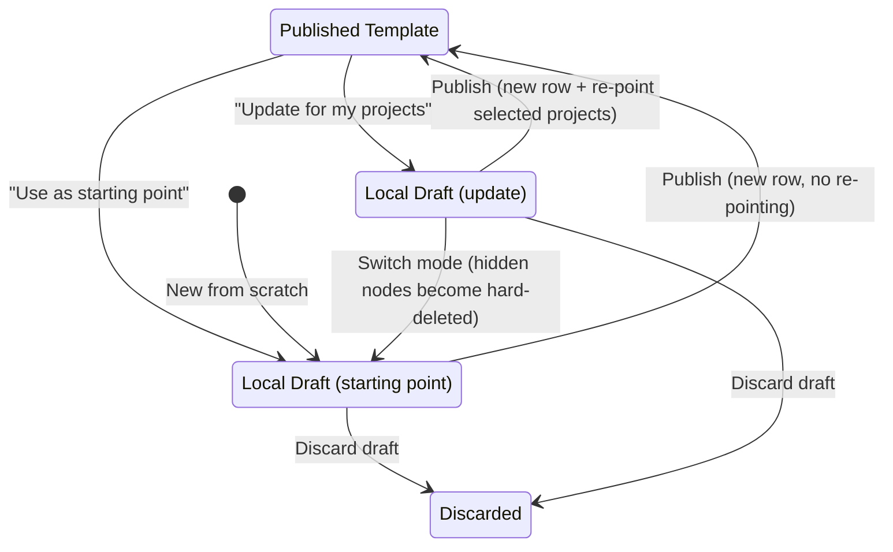
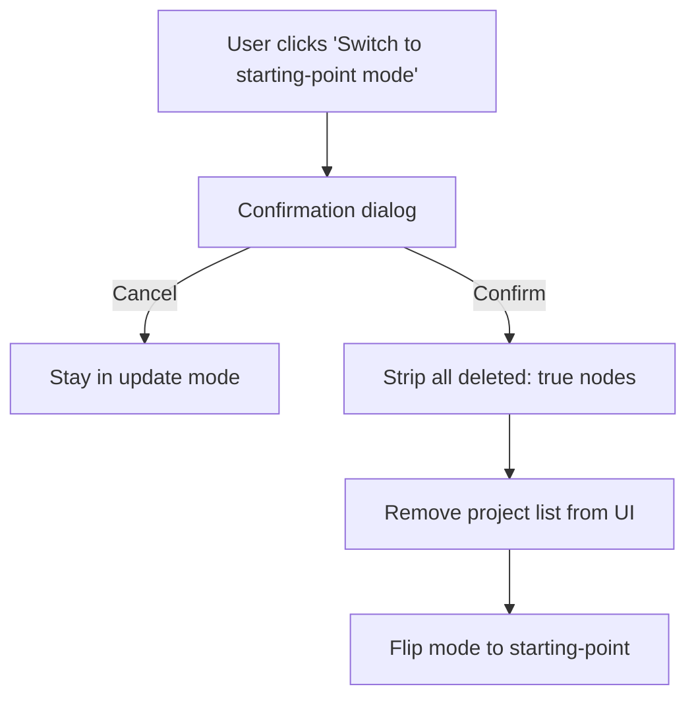
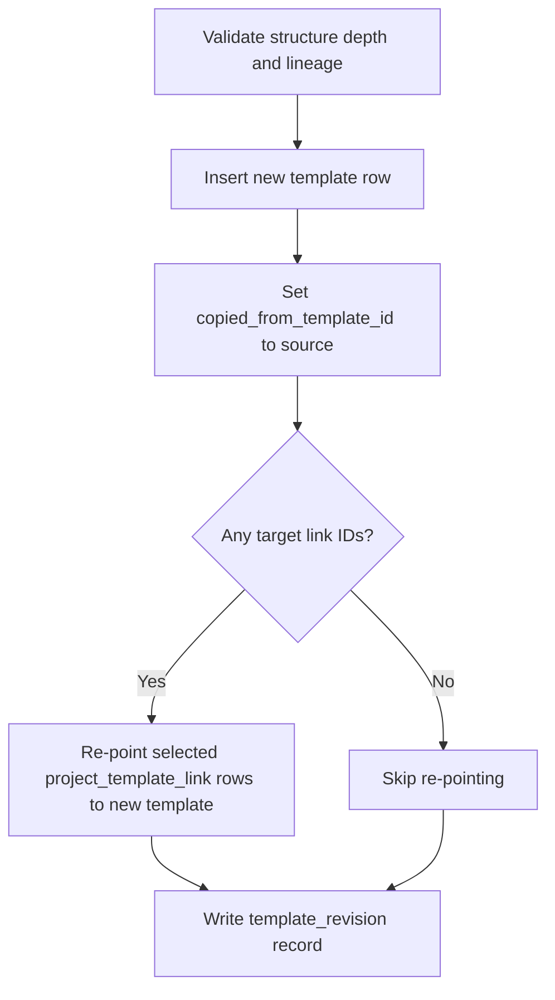

# Template Editing Lifecycle

## 1. Overview

Published templates (`template` rows) are **immutable snapshots**. Once a row is inserted, its structure JSONB never changes.

All editing happens in **browser IndexedDB**. There is no server-side draft state and no pessimistic locking — the local draft is the only copy until the user publishes.

Publishing **always inserts a new row**. The new row carries `copied_from_template_id` pointing back to the source, forming a provenance chain. Metadata fields (name, icon, shared) can still be edited in place on published templates via `save_template_metadata`.

## 2. Two Editing Modes



### "Use as starting point" mode

| Aspect | Behavior |
|---|---|
| **Entry** | Click "Use as starting point" on a published template, or create a new template from scratch |
| **Project list** | Not shown |
| **Node deletion** | Hard delete only — trash icon removes the node from JSONB entirely. No "hide" option. |
| **Hidden nodes from source** | If the source contains hidden nodes, the user is prompted to strip them on fork |
| **Publish** | Inserts a new `template` row. No project re-pointing. |

### "Update for my projects" mode

| Aspect | Behavior |
|---|---|
| **Entry** | Click "Update for my projects" on a published template |
| **Project list** | Shown with checkboxes — lists projects the user owns that are linked to the source template |
| **Node deletion** | Hide only — eye-off icon sets `deleted: true` on the node. Trash is disabled. |
| **Publish** | Inserts a new row **and** re-points selected `project_template_link` rows to it |

## 3. Hard Delete vs Soft Delete (Hide)

**Hard delete** removes the node from the JSONB structure entirely. It is only available in starting-point mode. The node is gone — no trace remains in the published snapshot.

**Soft delete (hide)** sets `deleted: true` on the node object. The node is hidden from user view but preserved in the JSONB so that linked projects retain their data mappings. Only available in update mode.

Both behaviors are enforced through centralized utilities in `hidden-nodes.ts`:

| Utility | Purpose |
|---|---|
| `countHiddenNodes(structure)` | Returns the number of nodes with `deleted: true` |
| `hasHiddenNodes(structure)` | Boolean check for any hidden nodes |
| `stripHiddenNodes(structure)` | Returns a new structure with all `deleted: true` nodes removed |

## 4. Mode Switch Flow

Only **update → starting-point** is possible. The reverse is not supported — once hidden nodes are stripped, they cannot be recovered.



The confirmation dialog explains the consequences: all hidden nodes will be permanently removed from the draft, and the publish will no longer re-point any projects.

## 5. Publish Flow

Both modes call the same `publish_template` RPC. The difference is in the arguments:

| Mode | `p_source_template_id` | `p_target_link_ids` |
|---|---|---|
| Starting point (new from scratch) | `null` | `[]` (empty) |
| Starting point (forked) | Source template ID | `[]` (empty) |
| Update | Source template ID | Array of selected link IDs |

The RPC always performs the same sequence:



## 6. Hidden Node Handling on Application

When a published template that contains hidden nodes (`deleted: true`) is applied to a **new** project, the user must be informed. The application flow presents the hidden node count and offers the option to strip them before applying, so the new project starts with a clean structure.

## 7. Provenance Chain

Every published template carries `copied_from_template_id`, forming a linked list of fork lineage:

```
Template A (original, copied_from = null)
  └── Template B (copied_from = A)
        └── Template C (copied_from = B)
              └── Template D (copied_from = C)
```

The `template_revision` table provides audit history for each publish event, storing:

- The full structure snapshot at time of publish
- An optional action log describing what changed

Together, `copied_from_template_id` and `template_revision` give complete traceability from any template back to its origin.

## 8. What Stays the Same

The following mechanisms are unchanged by the fork-based editing lifecycle:

- **`project_template_link.frozen`** — frozen links cannot be re-pointed to a new template. The template itself remains forkable.
- **`project_template_link`** — the join table between projects and templates, and the re-pointing mechanism used during publish.
- **`save_template_metadata` RPC** — in-place edits to name, icon, and shared flag on published templates. Does not touch structure.
- **`fork_template` RPC** — lightweight quick-clone that copies structure into a new row without opening the editor.
- **Mobile app** — reads published JSONB snapshots via PowerSync. No awareness of drafts or editing modes.
