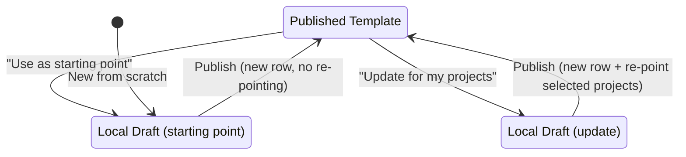

# Workflow Template System

Everything about how LangQuest handles review workflow templates — what they are, how they work, and why they work that way.

---

## What workflow templates are

A workflow template is a JSONB structure that defines a project's review process: what preparation steps translators complete before submitting, and what sequential review phases a submission passes through before final approval.

Workflow templates are stored as a single JSONB blob in a `workflow_template` table row. Projects link to workflow templates via `project_workflow_link`. Review entities (`review_decision`, `step_progress`) reference phases and steps within the JSONB by stable opaque IDs.

The mobile app reads workflow templates. The website edits them.

---

## Why this design exists

### The problem

LangQuest currently uses vote-based approval (net upvotes = approved). Partners like ETEN need multi-stage, group-based review (Team → Community → Church → Blessing Board). But ETEN's process is just one instance — other partners will define their own stages, groups, and rules.

We need a system that is:
- Configurable per partner/project
- Reusable across projects
- Editable after adoption
- Functional offline (read-only on mobile)

### Constraints that shaped the solution

| # | Constraint | Why it matters |
|---|-----------|----------------|
| C1 | Offline-first row-level sync (PowerSync + SQLite) | A single JSONB row syncing on infrequent edits is acceptable. The app is read-only on workflow templates. |
| C2 | No materialized phase/step/slot tables | Structure stored as JSONB. No O(templates × phases × slots) row explosion. Entities reference `phase_id`/`step_id` strings (nanoid). |
| C3 | Fork-based publishing | Each publish = new immutable row. No concurrent editing conflicts. No locks. |
| C4 | No CRDT, no pessimistic locking | Single-writer per browser. Editing is website-only. Immutable published rows eliminate concurrency problems. |
| C5 | Bounded, shallow structure | Max ~10 phases × ~5 slots each + ~10 steps. Much smaller than content templates. No depth limit needed. |
| C6 | One workflow per project | `project_workflow_link` enforces unique constraint on `project_id`. |
| C7 | Mid-project modification | Template can be updated after review has begun. Removed phases/steps use `deleted: true` tombstones to preserve existing references. |
| C8 | Opaque node IDs | `nanoid(10)`, immutable once created. Review decisions and step progress reference these. |
| C9 | Selective scope | An editor can only apply changes to projects they own. |
| C10 | Frozen project links | `frozen = true` on `project_workflow_link` prevents re-pointing mid-review. |
| C11 | No rollback | Reverting to a prior version could invalidate in-progress decisions. `workflow_template_revision` is audit-only. |
| C12 | Consistency with content templates | Same JSONB + fork-always + link-table architecture as the content template system. Shared mental model, similar utilities, similar RPCs. |

---

## Options considered and rejected

### Separate tables per structural element (workflow_template_phase, _group_slot, _step)

Rejected because:
- 4 new tables + foreign keys for what is a small, bounded, read-heavy structure
- More tables to sync via PowerSync
- Editing requires multi-table transactions
- JSONB approach is already proven by the content template system in the same codebase

### Snapshot/copy-on-instantiate (project gets its own denormalized copy of phases)

Initially proposed. Rejected in favor of the fork-always link model because:
- Fork-always gives the same isolation (changes don't propagate unless explicitly adopted)
- Avoids duplicating structure into project-specific rows
- Enables provenance tracking and lineage browsing
- Consistency with content templates

### Live-reference (projects always point to latest template version)

Rejected. Mid-review structural changes are dangerous — a phase disappearing while decisions exist against it causes inconsistency. Fork-always + explicit adoption is safer.

---

## How it works

### Database schema

Two new tables:

```
workflow_template
├── id (UUID, PK)
├── name, description, slug
├── structure (JSONB — phases + steps + group slots)
├── copied_from_template_id (FK → workflow_template, provenance)
├── shared, active
├── creator_id (FK → profile, null = system-provided)
├── project_count
├── created_at, last_updated
```

```
workflow_template_revision (audit only, not synced)
├── id (UUID, PK)
├── workflow_template_id (FK → workflow_template)
├── structure (JSONB snapshot)
├── actions (JSONB — structured diff)
├── saved_by, saved_at
```

Link table:

```
project_workflow_link
├── id (UUID, PK)
├── project_id (FK → project, UNIQUE)
├── workflow_template_id (FK → workflow_template)
├── frozen (prevents re-pointing)
├── active
├── created_at
```

Mapping table (connects abstract slots to real groups):

```
project_phase_group
├── id (UUID, PK)
├── workflow_link_id (FK → project_workflow_link)
├── phase_id (TEXT — nanoid into JSONB)
├── group_slot_id (TEXT — nanoid into JSONB)
├── group_id (FK → project_group)
```

### JSONB structure format

```json
{
  "format_version": 1,
  "steps": [
    {
      "id": "s1a2b3c4d5",
      "name": "Internalize",
      "order_index": 0,
      "description": "Read the passage multiple times until you can retell it from memory.",
      "required": true
    },
    {
      "id": "s2e3f4g5h6",
      "name": "Discuss Key Terms",
      "order_index": 1,
      "description": "Identify and agree on key terms as a team.",
      "required": true
    }
  ],
  "phases": [
    {
      "id": "p1x2y3z4w5",
      "name": "Team Review",
      "order_index": 0,
      "signoff_rule": "unanimous",
      "group_slots": [
        {
          "id": "g1m2n3o4p5",
          "name": "Translation Team",
          "description": "The translator's immediate team reviews for accuracy and naturalness."
        }
      ]
    },
    {
      "id": "p2a3b4c5d6",
      "name": "Community Check",
      "order_index": 1,
      "signoff_rule": "quorum",
      "quorum_threshold": 0.75,
      "group_slots": [
        {
          "id": "g2e3f4g5h6",
          "name": "Community Panel",
          "description": "Community members test for clarity and naturalness."
        }
      ]
    },
    {
      "id": "p3i4j5k6l7",
      "name": "Church Approval",
      "order_index": 2,
      "signoff_rule": "any_one",
      "group_slots": [
        {
          "id": "g3m4n5o6p7",
          "name": "Church Leaders"
        },
        {
          "id": "g4q5r6s7t8",
          "name": "Theological Advisor"
        }
      ]
    }
  ]
}
```

Key fields:
- `id` — nanoid(10), opaque, immutable. Entities reference this.
- `order_index` — explicit ordering (not positional in array).
- `signoff_rule` — `any_one` (first approval passes), `unanimous` (all members), `quorum` (threshold fraction).
- `group_slots` — abstract roles that projects fill with real `project_group` records via `project_phase_group`.
- `deleted` — `true` if soft-deleted (tombstone). Hidden from UI but preserved for referential integrity.

### How entities reference the JSONB

| Entity | References |
|--------|-----------|
| `step_progress` | `workflow_link_id` + `step_id` (string into `structure.steps[].id`) |
| `review_submission` | `workflow_link_id` + `current_phase_id` (string into `structure.phases[].id`) |
| `review_decision` | `phase_id` + `group_slot_id` (strings into JSONB) |
| `project_phase_group` | `phase_id` + `group_slot_id` (strings into JSONB) |
| `asset_anchor` | `step_id` (string into `structure.steps[].id`) |

### RPCs

| RPC | Purpose |
|-----|---------|
| `publish_workflow_template` | Insert new row. Optionally re-point selected non-frozen project links. Validates structure shape. |
| `fork_workflow_template` | Named clone: copies structure into new row. |
| `save_workflow_template_metadata` | In-place edit of name/description/shared. Does not touch structure. |
| `check_workflow_compatibility` | Before re-pointing: verifies all phase/step IDs referenced by existing decisions/progress exist in target. |

### Template composition

Users can view other shared workflow templates and fork them as a starting point. Unlike content templates, there is no subtree import — workflow templates are small enough that manual re-creation or full fork is sufficient.

---

## User experience

### Creating a workflow template

1. Coordinator goes to workflow templates on the website
2. Clicks "New" or "Use as starting point" on an existing one
3. Draft opens in a form editor (browser IndexedDB)
4. Defines steps (preparation) and phases (review stages with group slots)
5. Publishes → new `workflow_template` row inserted

### Editing a workflow template

Same two-mode pattern as content templates:

- **"Use as starting point"** — hard-deletes removed phases/steps (clean copy for new use)
- **"Update for my projects"** — soft-deletes removed phases/steps (`deleted: true` tombstones preserved)

At publish time, user chooses which projects adopt the new version.

### Linking to a project

1. Coordinator opens project settings → "Review Workflow" section
2. Picks a template from available list (shared + own)
3. System creates `project_workflow_link`
4. Coordinator maps each `group_slot` to a real `project_group` via the UI → creates `project_phase_group` rows

### Adopting a newer version

1. Coordinator sees "Update available" indicator (provenance chain shows newer forks)
2. Clicks "Adopt" → system runs `check_workflow_compatibility`
3. If compatible (all referenced IDs exist in new structure), re-points the link
4. If incompatible, shows which in-progress references would break

---

## Lifecycle



Published rows are immutable structurally. Metadata (name, description, shared) can be edited in place.

---

## Provenance

Every published template carries `copied_from_template_id`, forming a chain:

```
ETEN CBBT v1 (original, copied_from = null)
  └── ETEN CBBT v2 (copied_from = v1, added Blessing Board phase)
        └── MyProject Custom (copied_from = v2, removed Community Check)
```

`workflow_template_revision` provides per-publish audit history. Together they give full traceability.

---

## Compatibility checking

Before re-pointing a `project_workflow_link`, the system verifies:

1. Every `phase_id` referenced by existing `review_decision` rows exists in the target structure (including tombstoned phases)
2. Every `step_id` referenced by existing `step_progress` rows exists in the target structure (including tombstoned steps)
3. Every `phase_id` + `group_slot_id` pair in `project_phase_group` exists in the target

If any are missing, the re-point is blocked with an actionable error.

---

## Relationship to content templates

| Aspect | Content Templates | Workflow Templates |
|--------|------------------|-------------------|
| What it defines | Project content hierarchy (books, chapters, verses) | Review process (steps, phases, group slots) |
| JSONB complexity | Deep recursive tree (max depth 5) | Flat: two arrays (steps[], phases[]) |
| Table | `template` | `workflow_template` |
| Link table | `project_template_link` | `project_workflow_link` |
| Revision table | `template_revision` | `workflow_template_revision` |
| Entity references | `quest.template_node_id`, `asset.template_node_id` | `review_decision.phase_id`, `step_progress.step_id` |
| Edit model | Fork-always, browser drafts | Fork-always, browser drafts |
| Sync | Synced (read-only on mobile) | Synced (read-only on mobile) |
| Cardinality per project | Multiple (via multiple links) | One (unique constraint on project_id) |

Both systems share: JSONB structure, stable nanoid IDs, fork-always publishing, tombstone soft-deletes, frozen links, compatibility checking, revision history, and browser-side drafts.

---

## What this system does NOT cover

- **Who is in which group** — handled by `project_group` + `project_group_member` tables (see RFC section 7)
- **How review decisions flow** — handled by `review_submission`, `review_decision` tables and state machine (see RFC section 12)
- **Assignments** — handled by `assignment` table (see RFC section 8)
- **Audit trail** — handled by `review_event` (see RFC section 14)
- **Content structure** — handled by the content template system (`template` table)

This system only defines the blueprint of *what* steps and phases exist, and *what* group slots need filling.

---

## Terminology

| Term | Meaning |
|------|---------|
| Workflow template | A JSONB structure defining preparation steps and review phases |
| Step | A pre-translation preparation activity (e.g., "Internalize", "Discuss Key Terms") |
| Phase | A sequential review stage that submissions must pass through |
| Group slot | An abstract role within a phase that gets mapped to a real project group |
| Signoff rule | How a phase decides approval: any_one, unanimous, or quorum |
| Workflow link | The `project_workflow_link` row connecting a project to a workflow template |
| Frozen link | A workflow link with `frozen = true` — cannot be re-pointed |
| Fork | Creating a new template row based on an existing one |
| Tombstone | A step/phase/slot marked `deleted: true` — hidden but preserved |
| Publish | Inserting a new immutable template row |
| Draft | Local-only (IndexedDB) working copy being edited |
| Provenance | The `copied_from_template_id` chain linking forks to their source |
| Compatibility check | Validation that existing references still resolve in a new template version |

---

## Open questions

1. **System-provided templates** — Ship ETEN CBBT as a system template (`creator_id = null`). Should it be editable by anyone (fork-only) or also updatable by admins?
2. **Template discovery** — Workflow templates are fewer and simpler than content templates. Is a list with text search sufficient, or do we need languoid filtering?
3. **Phase skip/optional phases** — Current design is strictly linear. Should some phases be skippable based on conditions?
4. **Quorum denominator** — Fraction of what? Active group members at time of submission? At time of decision?
5. **Maximum phases/steps** — Need a reasonable upper bound for validation? Content templates cap at depth 5; workflow templates might cap at ~20 phases and ~20 steps.
